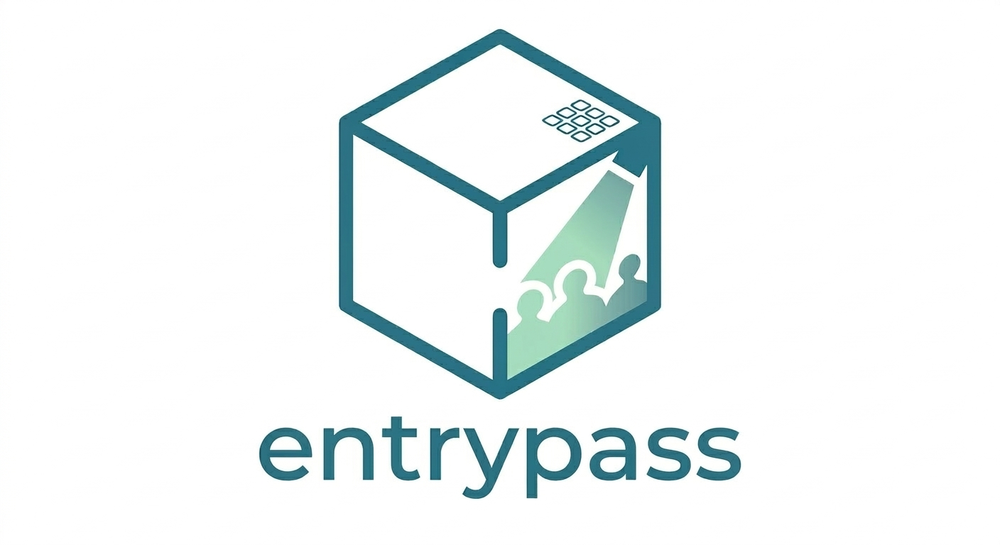
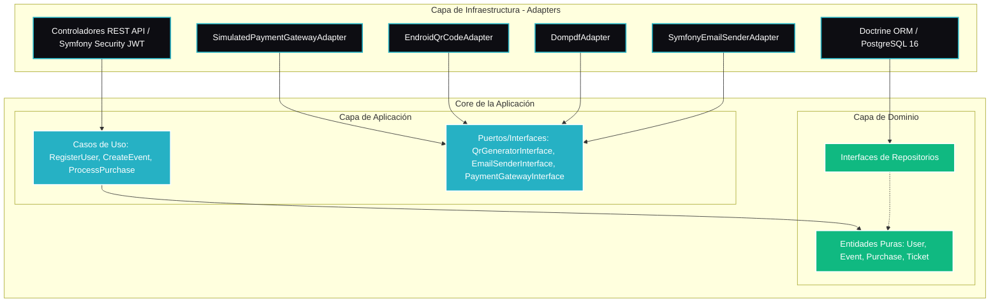

# EntryPass

<div align="center">
  
  
  <h1>EntryPass</h1>
  <p><strong>Plataforma Web Premium de Compra y Gestión de Entradas con Procesamiento Asíncrono y Arquitectura Hexagonal</strong></p>

  <p>
    
    
    
    
    
    
  </p>
</div>

---

## 📖 Descripción General

**EntryPass** es una plataforma web integral de compra-venta de entradas para eventos (inspirada en la funcionalidad y flujo de plataformas como *Eventbrite* y *Ticketmaster*). El sistema permite a los usuarios descubrir eventos musicales, culturales o deportivos, registrarse, comprar entradas de forma segura mediante un flujo interactivo hiperrealista y obtener tickets digitales que integran **códigos QR securizados y PDFs auto-generados** para el control de acceso en puerta.

El proyecto ha sido concebido bajo estándares de ingeniería de software empresarial, demostrando el dominio absoluto de:
1. **Desacoplamiento Tecnológico:** Implementación rigurosa de una **Arquitectura Hexagonal (Ports & Adapters)** en el backend.
2. **Escalabilidad y Rendimiento:** Delegación de tareas pesadas de generación visual e email mediante procesamiento asíncrono con **RabbitMQ**.
3. **Experiencia de Usuario (UI/UX) Excepcional:** Interfaz web fluida basada en componentes interactivos SPA con **Angular 21 (Signals & Zoneless)** y estilos CSS nativos modulares bajo una estética *Premium Dark Mode*.

---

## 📚 Documentación Adicional

Puedes consultar las guías detalladas adaptadas según tu rol en la plataforma:

*   📖 **[Manual del Cliente / Usuario Final](docs/manual_usuario.md):** Instrucciones sobre cómo explorar eventos, realizar la compra con la pasarela simulada y ver tus entradas con códigos QR en tu perfil.
*   ⚙️ **[Manual del Administrador / Organizador](docs/manual_administrador.md):** Guía completa de administración de espectáculos (CRUD y baja lógica), control de accesos con el escáner QR en portería y diagnóstico técnico del sistema (RabbitMQ, puertos locales y base de datos).
*   📈 **[Guía de Estilos UI/UX y Prototipado](docs/guia_estilos_prototipado.md):** Resumen de decisiones de diseño, paleta tipográfica y cromática del entorno premium.

---

## 🏛️ Arquitectura del Sistema

### 1. Flujo Global Asíncrono

La aplicación separa estrictamente el flujo transaccional de cara al usuario del procesamiento de recursos pesados. Esto garantiza tiempos de respuesta del servidor ultra-bajos e inmunidad frente a picos de carga.

```mermaid
graph TD
    %% Estilo del Diagrama
    classDef client fill:#26b1c4,stroke:#000,stroke-width:2px,color:#fff;
    classDef proxy fill:#0d0d12,stroke:#26b1c4,stroke-width:2px,color:#fff;
    classDef backend fill:#777BB4,stroke:#000,stroke-width:2px,color:#fff;
    classDef db fill:#4169E1,stroke:#000,stroke-width:2px,color:#white;
    classDef queue fill:#FF6600,stroke:#000,stroke-width:2px,color:#white;
    classDef worker fill:#10b981,stroke:#000,stroke-width:2px,color:#white;

    U[Usuario / Cliente]:::client -->|Petición HTTPS| NG[Nginx Reverse Proxy]:::proxy
    NG -->|Sirve Angular SPA| U
    NG -->|Proxy /api| SY[Symfony API REST]:::backend
    
    SY -->|Transacción ACID| PG[(PostgreSQL 16)]:::db
    SY -->|1. Publica Compra| RMQ{RabbitMQ Broker}:::queue
    
    subgraph Procesamiento Asíncrono (Worker)
        W[Symfony Messenger Worker]:::worker -->|2. Consume Mensaje| RMQ
        W -->|3. Genera QR & PDF| PDF[Generador Dompdf/QR]:::worker
        W -->|4. Envía Entrada| SMTP[Servidor SMTP / Correo]:::worker
    end
    
    SMTP -.->|5. Recibe Ticket PDF| U
```

### 2. Capas de la Arquitectura Hexagonal (Ports & Adapters)

El backend de Symfony se organiza de forma que las reglas de negocio críticas estén completamente protegidas de cambios en frameworks, bases de datos o librerías de terceros.



---

## 🛠️ Stack Tecnológico

| Componente | Tecnología | Características y Rol en el Sistema |
|---|---|---|
| **Frontend** | **Angular 21** | SPA de alta fidelidad con reactividad nativa mediante *Signals* (Zoneless). |
| **Diseño y Estilos** | **CSS3 Nativo** | Estética *Premium Dark* con efectos translúcidos (Glassmorphism), variables CSS y Grid/Flexbox responsivo. |
| **Backend API** | **Symfony 7 (PHP 8.4)** | API REST con tipado estricto, inyección de dependencias y LexikJWT para seguridad de sesión. |
| **Base de Datos** | **PostgreSQL 16** | Integridad referencial con UUIDs y transacciones ACID nativas para control de aforo. |
| **Mensajería asíncrona** | **RabbitMQ** | Broker de colas que gestiona de manera asíncrona la orquestación del envío de entradas. |
| **Despliegue** | **Docker & Compose** | Contenerización multi-stage para desarrollo (6 servicios) y producción optimizada (5 servicios con Nginx). |

---

## 🚀 Guía de Instalación y Puesta en Marcha

El proyecto dispone de un `Makefile` y está totalmente automatizado con Docker para que su puesta en marcha sea sencilla e inmediata, sin requerir la instalación local de PHP, Node ni PostgreSQL en el sistema anfitrión.

### Prerrequisitos

*   **Docker Desktop** (con soporte para Docker Compose).
*   Un entorno de terminal compatible con comandos `make` (en Windows se recomienda usar **WSL2**, **Git Bash** o **PowerShell** con la utilidad Make instalada).

---

### 💻 Opción A: Modo Desarrollo (Con Hot-Reload)

Este modo levanta los servicios locales, incluyendo un contenedor de Node para servir Angular con recarga en caliente frente a cualquier cambio en el código del frontend.

1.  **Clonar el repositorio y acceder a él:**
    ```bash
    git clone https://github.com/JoseRomanDev/EntryPass.git
    cd EntryPass
    ```

2.  **Construir e inicializar los contenedores:**
    ```bash
    make build
    make up
    ```
    > [!IMPORTANT]
    > La primera ejecución puede tardar unos minutos ya que Docker descargará y compilará las imágenes base de PHP-FPM, Nginx, PostgreSQL, RabbitMQ y Node.

3.  **Instalar dependencias del sistema:**
    ```bash
    # Descargar dependencias PHP de Symfony
    docker compose exec php composer install
    
    # Descargar dependencias de Node del Frontend
    docker compose exec node npm install
    ```

4.  **Ejecutar migraciones de Base de Datos:**
    ```bash
    docker compose exec php php bin/console doctrine:migrations:migrate -n
    ```

5.  **Generar el par de claves JWT para Autenticación:**
    ```bash
    docker compose exec php php bin/console lexik:jwt:generate-keypair
    ```

6.  **Cargar datos de prueba iniciales (Seeds):**
    ```bash
    # Crear usuario administrador (admin@entrypass.com / Admin123!)
    make seed
    
    # Insertar eventos de demostración y categorías
    make seed-demo
    ```

7.  **Acceder a la aplicación:**
    *   **Plataforma Web (Nginx Proxy):** [http://localhost:8080](http://localhost:8080)
    *   **Angular Dev Server Directo:** [http://localhost:4200](http://localhost:4200)

---

### 🌐 Opción B: Modo Producción (Optimizado)

Este modo simula un entorno real en producción. Mediante un **Dockerfile multi-stage**, se compilan los estáticos de Angular (`ng build --configuration=production`) y se copian directamente en un servidor web **Nginx optimizado**, eliminando por completo la necesidad del contenedor de Node en ejecución.

1.  **Construir y arrancar contenedores en producción:**
    ```bash
    make prod-up
    ```

2.  **Instalar dependencias del Backend:**
    ```bash
    docker compose -f compose.prod.yml exec php composer install
    ```

3.  **Configurar base de datos y llaves criptográficas:**
    ```bash
    # Migraciones
    docker compose -f compose.prod.yml exec php php bin/console doctrine:migrations:migrate -n
    
    # Generar claves JWT
    docker compose -f compose.prod.yml exec php php bin/console lexik:jwt:generate-keypair
    ```

4.  **Cargar las semillas de datos (Seeds):**
    ```bash
    # Administrador
    docker compose -f compose.prod.yml exec php php bin/console app:seed-admin
    
    # Eventos de Demo
    docker compose -f compose.prod.yml exec php php bin/console app:seed-demo
    ```

5.  **Acceder a la aplicación de producción:**
    *   **Plataforma Web:** [http://localhost:8080](http://localhost:8080)
    *   **RabbitMQ Dashboard:** [http://localhost:15672](http://localhost:15672) (Usuario: `guest` / Clave: `guest`)

---

## 🎓 Guía Rápida de Demostración y Testeo

Para validar de inmediato el ecosistema completo sin registros manuales previos, sigue esta guía rápida utilizando los datos cargados por los Seeds:

### 1. Credenciales Preconfiguradas

| Perfil | Email | Contraseña | Rol / Permisos |
|---|---|---|---|
| **Administrador** | `admin@entrypass.com` | `Admin123!` | Acceso completo al Panel de Control administrativo y edición de eventos. |
| **Usuario Normal** | `user@entrypass.com` | `User123!` | Usuario final simulado para compras rápidas. |

### 2. Flujo de Compra y Simulación de Pago (Stripe Elements)

Al comprar entradas en la aplicación, se desplegará el modal de pago de alta fidelidad. Para probar el sistema, introduce cualquier número de tarjeta que cumpla con el formato estándar (p. ej., la clásica tarjeta de pruebas de Stripe):

*   **Número de Tarjeta:** `4242 4242 4242 4242`
*   **Fecha de Expiración:** `12/29`
*   **CVC:** `123`
*   **Nombre del Titular:** `Cualquier Nombre` (mínimo 4 letras)

> [!TIP]
> El sistema de pagos simula latencias de procesamiento de red (1.5 segundos) e implementa un comportamiento aleatorio controlado del 5% de rechazo por "fondos insuficientes" en el backend para demostrar el manejo de excepciones y errores transaccionales en tiempo real.

---

## 🗂️ Comandos Rápidos del Makefile

El proyecto cuenta con un abanico completo de comandos en el `Makefile` para agilizar las tareas cotidianas de administración y desarrollo:

| Comando | Descripción |
|---|---|
| `make up` | Levanta los contenedores en modo **Desarrollo** en segundo plano. |
| `make down` | Detiene y destruye los contenedores de desarrollo. |
| `make build` | Reconstruye las imágenes de Docker de desarrollo. |
| `make prod-up` | Construye Angular en producción y levanta el entorno optimizado. |
| `make prod-down` | Detiene y destruye el entorno de producción. |
| `make php` | Abre un terminal Bash interactivo dentro del contenedor de Symfony. |
| `make node` | Abre un terminal interactivo dentro del contenedor de Angular. |
| `make seed` | Inserta el usuario administrador predeterminado. |
| `make seed-demo` | Inserta eventos, categorías y aforos de prueba. |
| `make test` | Ejecuta la suite completa de pruebas unitarias y funcionales en PHPUnit. |

---

## 🧪 Pruebas Automatizadas (Testing)

El backend de la aplicación cuenta con un blindaje técnico mediante pruebas unitarias y de integración desarrolladas con **PHPUnit**, adaptadas a PHP 8.4 y PHPUnit 10+.

Para ejecutar las pruebas y comprobar la fiabilidad del sistema de compras y pasarela:

```bash
# Ejecutar suite de pruebas completa en desarrollo
docker compose exec php php bin/phpunit

# O mediante el atajo del Makefile
make test
```

Las pruebas cubren aspectos críticos de negocio:
*   **Pruebas Unitarias:** Aislamiento de los casos de uso (`Casos de Uso` / `Handlers`) utilizando stubs y mocks nativos de PHPUnit para evitar interacciones reales con la base de datos o el gestor de correo.
*   **Pruebas Funcionales (Integración):** Flujo completo de la API REST que verifica la validación de aforo ante compras concurrentes, la expiración de tokens JWT y la integridad del endpoint de validación en portería (`/api/tickets/validate`).
