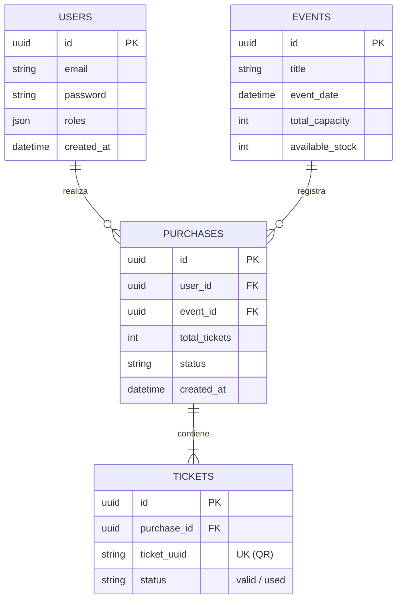

---
# ENTRYPASS
## Plataforma Web de Gestión y Compra de Entradas para Eventos

---

**Trabajo de Fin de Grado**  
**Ciclo Formativo de Grado Superior en Desarrollo de Aplicaciones Web (DAW)**

---

| Campo | Información |
|-------|-------------|
| **Autor** | José Manuel Román Navarro |
| **Correo electrónico** | josemanuel.rnav@gmail.com |
| **Teléfono** | 695 386 759 |
| **Curso** | 2º DAW |
| **Modalidad** | Individual |
| **Tiempo estimado** | 250 horas |
| **Fecha de entrega** | Marzo 2026 |

---

## ÍNDICE

1. [Introducción y Justificación](#1-introducción-y-justificación)
2. [Objetivos del Proyecto](#2-objetivos-del-proyecto)
3. [Público Objetivo (Target)](#3-público-objetivo-target)
   - 3.1. [Perfil del usuario final](#31-perfil-del-usuario-final)
   - 3.2. [Perfil del organizador de eventos](#32-perfil-del-organizador-de-eventos)
   - 3.3. [Caso de uso típico: Flujo de compra y acceso](#33-caso-de-uso-típico-flujo-de-compra-y-acceso)
4. [Tecnologías a Emplear y Justificación](#4-tecnologías-a-emplear-y-justificación)
   - 4.1. [Frontend](#41-frontend)
   - 4.2. [Backend](#42-backend)
   - 4.3. [Infraestructura y servicios](#43-infraestructura-y-servicios)
   - 4.4. [Herramientas de desarrollo](#44-herramientas-de-desarrollo)
5. [Estado del Arte](#5-estado-del-arte)
   - 5.1. [Descripción del problema o necesidad detectada](#51-descripción-del-problema-o-necesidad-detectada)
   - 5.2. [Análisis de soluciones existentes](#52-análisis-de-soluciones-existentes)
   - 5.3. [Limitaciones de las soluciones actuales](#53-limitaciones-de-las-soluciones-actuales)
   - 5.4. [Margen de mejora y propuesta de valor](#54-margen-de-mejora-y-propuesta-de-valor)
6. [Arquitectura del Sistema](#6-arquitectura-del-sistema)
7. [Bases de Datos y Modelo](#7-bases-de-datos-y-modelo)
8. [Lógica del Flujo de Navegación](#8-lógica-del-flujo-de-navegación)
9. [Manual de Uso (Aproximación UI)](#9-manual-de-uso-aproximación-ui)
10. [Metodología de Desarrollo](#10-metodología-de-desarrollo)
11. [Estado Actual del Proyecto](#11-estado-actual-del-proyecto)
12. [Planificación y Roadmap](#12-planificación-y-roadmap)

---

## 1. Introducción y Justificación

El sector de la organización de eventos ha experimentado un crecimiento considerable en los últimos años, siendo cada vez más habitual la venta de entradas online para conciertos, conferencias, festivales y actividades culturales. No obstante, muchos organizadores de pequeño y mediano tamaño carecen de herramientas tecnológicas adecuadas para gestionar de forma eficiente el proceso de venta, el control de asistentes y la validación de acceso.

**EntryPass** surge como respuesta a esta necesidad. Se trata de una plataforma web completa para la gestión y compra de entradas de eventos, con un enfoque en la accesibilidad para organizadores pequeños y la fluidez de experiencia para el usuario final.

Desde el punto de vista académico, este proyecto constituye el **Trabajo de Fin de Grado (TFG)** del ciclo formativo de Grado Superior en Desarrollo de Aplicaciones Web (DAW). Su propósito es demostrar el dominio de una arquitectura moderna y profesional, aplicando los conocimientos adquiridos a lo largo del ciclo en áreas como el desarrollo frontend y backend, el diseño de APIs, la contenerización de aplicaciones y el procesamiento asíncrono mediante colas de mensajes.

---

## 2. Objetivos del Proyecto

Los principales objetivos de EntryPass se han definido buscando no solo la funcionalidad, sino también la operatividad medible en un entorno real:

1. **Diseñar y desarrollar una plataforma web completa** de compra de entradas, accesible tanto para usuarios finales como para organizadores.
   * *Métrica de éxito:* Despliegue funcional de ambos perfiles (organizador y cliente) operando sobre la misma plataforma unificada.
2. **Implementar un frontend SPA moderno con Angular.**
   * *Métrica de éxito:* Lograr una navegación ágil con tiempos de carga de vistas menores a 1 segundo, gestionando el enrutamiento sin recargas completas de la página.
3. **Desarrollar una API REST robusta con Symfony.**
   * *Métrica de éxito:* Procesar concurrencia simulada comprobando tiempos de respuesta de la API estables (inferiores a 500ms en condiciones normales).
4. **Implementar procesamiento asíncrono para tareas costosas** (generación de QR, envío de correos) mediante RabbitMQ y Symfony Messenger.
   * *Métrica de éxito:* La respuesta al usuario al darle al botón de "Comprar" debe completarse en menos de 1 segundo (solo grabando en BD), delegando todo el trabajo pesado a procesos de fondo que no penalicen la experiencia de usuario.
5. **Generar entradas digitales y habilitar su validación infalible.**
   * *Métrica de éxito:* Escanear el código QR y cambiar instantáneamente su estado en tiempo real (`valid` → `used`), impidiendo matemáticamente la reutilización o fraude por duplicidad.

---

## 3. Público Objetivo (Target)

EntryPass está orientado a dos perfiles de usuario diferenciados, aunque interdependientes:

### 3.1. Perfil del usuario final
- **Características:** Acostumbrados a ecosistemas web/móvil, exigen agilidad y confirmaciones inmediatas al pagar.
- **Necesidades detectadas:** Proceso de compra sin fricciones, confirmación instántanea en pantalla y acceso fácil a su entrada digital en el móvil.

### 3.2. Perfil del organizador de eventos
- **Características:** Promotores independientes, asociaciones o salas pequeñas que necesitan gestionar aforo y controlar los accesos el día del evento de forma fácil.
- **Necesidades detectadas:** Autonomía tecnológica, reducción de grandes comisiones y una herramienta de escaneo rápida (portería).

### 3.3. Caso de uso típico: Flujo de compra y acceso
Para ilustrar claramente el uso realista de la aplicación, el "escenario ideal" cerrado y controlado es el siguiente:
1. **Exploración:** Un usuario sin cuenta accede a la landing y ve un festival anunciado. Al hacer clic en "Comprar entrada", la app detecta falta de sesión y redirige al flujo de login/registro.
2. **Compra (Flujo de alta disponibilidad):** Una vez autenticado, selecciona 2 tickets. Al confirmar, el sistema registra la compra en milisegundos y confirma visualmente en pantalla.
3. **Asincronía:** El sistema de fondo (RabbitMQ) se entera de la compra, genera los 2 UUID únicos, dibuja los QRs, empaqueta un PDF y se lo envía al correo del usuario mientras este ya puede seguir navegando.
4. **Control de Puerta:** El día del evento, el organizador utiliza la vista móvil de la plataforma para escanear el QR del usuario en la puerta. Si está válido, la pantalla parpadea en verde y descuenta aforo. Si vuelve a pasar el mismo QR, indica en rojo "Entrada ya utilizada".

---

## 4. Tecnologías a Emplear y Justificación

La selección tecnológica responde a criterios de arquitectura empresarial, buscando separar muy bien las responsabilidades y asegurar escalabilidad.

### 4.1. Frontend
* **Angular (SPA):** Se elige frente a enfoques tradicionales debido a su estructuración obligatoria y clara (módulos/features). Permite desarrollar una experiencia de usuario extremadamente interactiva y limpia donde el DOM solo se repinta cuando es estrictamente necesario, algo vital en los "carritos de compra".

### 4.2. Backend
* **Symfony (PHP 8.4) y Arquitectura Hexagonal:** Se descartan opciones más monolíticas porque Symfony aporta un control rígido y formal del código. La arquitectura Hexagonal (Puertos y Adaptadores) es una decisión arquitectónica clave: aísla las reglas de nuestro negocio de la infraestructura. Si mañana la base de datos cambia o la librería de PDF queda obsoleta, el Core de nuestro sistema no se toca, solo se cambia el adaptador.
* **Symfony Messenger:** Es nativo en Symfony, lo que facilita enormemente el dispatching o encolado de mensajes frente a tener que crear scripts demonio manuales.

### 4.3. Infraestructura y servicios
* **Docker & Docker Compose:** Utilizado para eliminar el eterno problema de "en mi máquina sí funciona". Garantiza que cualquier ordenador que clone el repo pueda levantar exactamente las mismas versiones de BD y PHP al instante.
* **RabbitMQ:** ¿Por qué un broker dedicado en lugar de usar cron jobs o tablas en la base de datos? RabbitMQ retiene el mensaje en la memoria, avisa automáticamente al nodo suscriptor y maneja "reintentos automáticos" si la generación del PDF falla, garantizando cero pérdidas en la entrega de tickets, descargando a la DB transaccional de todo ese esfuerzo.
* **PostgreSQL:** Optimizada para consistencia relacional severa y operaciones ACID, fundamental a la hora de manipular facturas y control de stock real.

---

## 5. Estado del Arte

### 5.1. Análisis de soluciones existentes y limitaciones
En la actualidad, plataformas como Eventbrite o Ticketmaster lideran el mercado. Su mayor inconveniente reside en su modelo de ingresos (comisiones elevadas, a veces hasta el 6% + tarifa base por ticket) y lo abrumadoras que resultan sus interfaces de gestión para eventos pequeños (como un festival de conservatorio o las jornadas de una asociación pequeña). En estos estratos, el control de puerta todavía se ejerce demasiadas veces usando listas de papel impresas, provocando errores humanos y colas innecesarias debido a la lentitud en el cotejo de nombres.

### 5.2. Comparativa Visual y Margen de Mejora
| Característica | EntryPass | Eventbrite | Entradium |
|-----------------|------------|------------|------------|
| Coste por uso | **Gratuito / Privado** | Altas comisiones | Media/Baja |
| Independencia de datos e infra | **Alta (Self-Hosted local/cloud)** | Nula | Nula |
| Control ágil asíncrono en tickets | **Sí (RabbitMQ)** | Sí | Limitado |
| Orientación visual para organizador | **Simple y directa** | Muy compleja | Simple |

**Propuesta de valor:** La plataforma prioriza la "no-fricción". El pequeño promotor domina cien por cien el flujo y el dato; no paga comisiones abusivas por ticket y dispone de un control de acceso automatizado tan eficaz como el de una empresa de primer nivel sin necesidad de infraestructura pesada.

---

## 6. Arquitectura del Sistema

El sistema sigue una arquitectura de **SPA + API REST + Procesamiento Asíncrono**. Se ha consolidado el flujo asíncrono para la compra y emisión de entradas con un cumplimiento estricto de la **Arquitectura Hexagonal**.

1. **Flujo Principal:** `Usuario -> Angular SPA -> Nginx -> Symfony API -> PostgreSQL`.
2. **Procesamiento Asíncrono:** Tareas pesadas (crear códigos QR, ensamblar PDFs) delegan en **RabbitMQ** y son procesadas por un `worker` (Symfony Messenger).

### Arquitectura Backend (Hexagonal)
* **Domain**: Sin dependencias externas. Contiene `User`, `Event`, `Purchase`, `Ticket`. La lógica aísla la "transacción de compra general" (Purchase) de los "tokens o entradas concretas" emitidas (Ticket).
* **Application**: Casos de uso (`CreateEventHandler`, `RegisterUserHandler`). Implementación de "Puertos" (interfaces abstractas para QR, email, pdf).
* **Infrastructure**: Adaptadores (`DompdfAdapter`, `EndroidQrCodeAdapter`), controladores REST y repositorios Doctrine.

---

## 7. Bases de Datos y Modelo

La plataforma descansa sobre una base de datos relacional PostgreSQL. El modelo de datos se estructura bajo el principio de consistencia absoluta, dividiendo la carga de la siguiente manera:

* **Users:** Almacena la información de autenticación y perfilado (Organizador o Cliente estándar).
* **Events:** Guarda el metadato del evento (título, fechas, total de aforo reservable, stock actual).
* **Purchases (Compras):** Es un apunte contable global. Un usuario realiza *una única* compra que incluye múltiples asientos.
* **Tickets (Entradas):** Relación de "1 a N" con la compra. Cada ticket es único e independiente, posee su propio `UUID` inviolable y puede tener distintos estados (ej. `valid`, `used`, `cancelled`). Así si se compra un paquete de 3 entradas, una persona puede entrar al recinto antes que sus amigos, puesto que los 3 QRs son completamente independientes.

A continuación, se ilustra el Diagrama Entidad-Relación (ER) simplificado del núcleo de datos:

---

## 8. Lógica del Flujo de Navegación

Todo el diseño del front y back se implementa siguiendo la pauta de **"Flujo cerrado y controlado", previendo las caídas y evitando puntos muertos:**

* **Gestión de Sesiones (JWT):** Si un usuario guardó en el navegador un token pero este expiró, la aplicación web intercepta la petición (HttpInterceptor en Angular), detecta el error 401 del backend, destruye la cookie local y redirige silenciosamente al usuario a la pantalla de Login, mostrando un *toast* amable: "Tu sesión ha expirado", sin romper la ventana y guiándole al punto de partida natural.
* **Transacciones fallidas (Stock vaciado):** Escenario: Dos usuarios intentan comprar la última entrada a la vez. Cuando la segunda petición llega al back, el stock de la DB salta con error. La transacción Doctrine hace *rollback* completo, evita que el cobro avance y devuelve un aviso JSON controlado. El frontal lee este aviso y muestra un modal interrumpiendo un posible paso ciego: *"Lo sentimos, el aforo se ha completado hace unos segundos"*, e invitando a consultar otros eventos.

---

## 9. Manual de Uso (Aproximación UI)

*Esta sección se enriquecerá en el documento final con capturas reales cuando el portal web definitivo esté terminado.*

Aunque la plataforma es intuitiva por diseño, se considerarán manuales integrados para flujos no convencionales:

* **Escaneo en Puerta (Validación):** 
  *(Placeholder Imagen: Vista móvil organizador. Pantalla escáner abierta enfocando un QR).*
  **Regla de usabilidad:** El escáner solo tiene dos respuestas de color para evitar confusión humana en ambientes oscuros. **Fondo Verde** y sonido "ding": Ticket válido, puede entrar. **Fondo Rojo** vibrando: Error, entrada caducada, inexistente o ya sellada. No se ofrece más información irrelevante al portero técnico, priorizando la velocidad de cola.

---

## 10. Metodología de Desarrollo

Para gestionar de forma coherente y continua tamaño y plazos ajustados, el proyecto se está abordando según iteraciones inspiradas en **metodologías ágiles (Scrum/Kanban)** sumado al uso de controles de versión robustos (Git):

1. **Gestión de Tareas:** Se planifican los "Sprints" funcionales (Ej: *Fase Auth*, *Fase Control QR*).
2. **Atomicidad:** Se emplean commits atómicos por característica concreta en el historial de Git, permitiendo la trazabilidad total de qué capa se ve afectada.
3. **Flujo de Ramas:** Se utiliza separación de ramas `main` para código estable entregable y funcionalidad de entorno local paralela para integración continua.
4. **Ciclo TDD limitado:** En el backend Hexagonal se favorece la escritura de pruebas en los casos de uso aislados *(Dominio)* para verificar el flujo de la mensajería sin estresar la base de datos con dependencias externas.

---

## 11. Estado Actual del Proyecto

A fecha de la presente entrega, se han implementado las siguientes bases fundamentales:

- ✅ **Infraestructura Docker completa:** PostgreSQL, RabbitMQ, PHP-FPM, Nginx, Node, Worker orquestados.
- ✅ **Capa de Dominio y Aplicación:** Entidades principales y casos de uso con arquitectura de Puertos y Adaptadores bien consolidada. Emisión asíncrona probada.
- ✅ **Capa de Infraestructura:** Persistencia y envíos mediante Symfony Mailer.
- 🔄 **Frontend Angular:** Proyecto inicializado.

---

## 12. Planificación y Roadmap

| Fase | Descripción | Estado |
|------|-------------|--------|
| **Fase 1 – Infraestructura** | Dockerización completa del entorno y configuración de todos los servicios. | ✅ Completada |
| **Fase 2 – Dominio y Aplicación** | Definición de entidades, interfaces y primeros casos de uso. | ✅ Completada |
| **Fase 3 – API REST** | Autenticación JWT y lógica core robustecida en infraestructura. | ✅ Completada |
| **Fase 4 – Gestión de Tickets y QR** | Generación asíncrona de QR y envío de email mediante RabbitMQ. | ✅ Completada |
| **Fase 5 – Validación de Acceso** | Endpoint de verificación de QR para cambiar estado (`valid` -> `used`). | ⏳ Pendiente |
| **Fase 6 – Frontend SPA** | Pantallas responsivas de Angular: eventos, compra interactiva y perfil. | ⏳ Pendiente |
| **Fase 7 – Testing final y QA** | Validación del flujo completo de cara a producción simulada. | ⏳ Pendiente |

---

*Documento generado para la nueva entrega de revisión de la memoria del TFG – Marzo 2026, incluyendo pautas y feedback del evaluador.*
